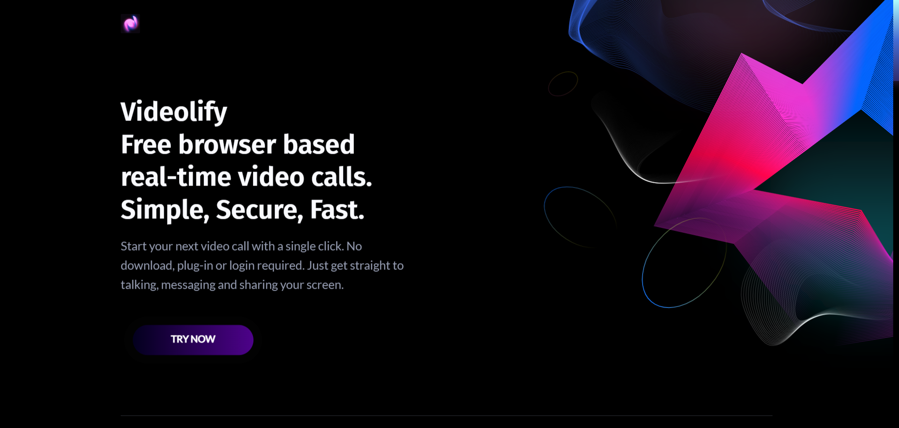

# Videolify

🚀 `A free WebRTC browser-based video call, chat and screen sharing` 🚀

<br>

Powered by `WebRTC` using google Stun and [numb](http://numb.viagenie.ca/) Turn. `Videolify` provides video quality and latency not available with traditional technology.

Open the app in one of following **supported browser**

[](https://videolify.up.railway.app/)

## https://videolify.up.railway.app/

<br>

[](https://videolify.cleverapps.io/)

## Features

- Is `100% Free` - `Open Source` - `Self Hosted` and [PWA](https://en.wikipedia.org/wiki/Progressive_web_application)!
- No download, plug-in, or login required, entirely browser-based
- Unlimited number of conference rooms without call time limitation
- Translated in 133 languages
- Host protection to ensure unauthorized access to your host
- Possibility to password protect the room during the meeting
- Desktop and Mobile compatible
- Optimized Room URL Sharing for mobile
- Webcam Streaming (Front - Rear for mobile)
- Audio Streaming crystal clear with detect speaking and volume indicator
- Screen Sharing to present documents, slides, and more...
- File Sharing (with drag-and-drop), share any files to your participants in the room
- Select Audio Input - Output and Video source
- Ability to set video quality up to 4K and 60 FPS
- Recording your Screen, Audio and Video
- Snapshot the video frame and save it as image png
- Chat with Emoji Picker to show you feeling, private messages, Markdown support, possibility to Save the conversations, and many more
- Speech recognition to send the speeches
- Advance collaborative whiteboard for the teachers
- Share any YT Embed video, video mp4, webm, ogg and audio mp3 in real-time
- Full-Screen Mode on mouse click on the Video element, Pin/Unpin, Zoom in-out video element
- Possibility to Change UI Themes
- Right-click on the Video elements for more options
- Direct `peer-to-peer` connection ensures the lowest latency thanks to `WebRTC`
- Supports [REST API](app/api/README.md) (Application Programming Interface)
- [Slack](https://api.slack.com/apps/) API integration
- [Sentry](https://sentry.io/) error reporting
- ...

## Demo

- `Open` https://videolify.cleverapps.io/newcall `or` https://videolify.up.railway.app/newcall
- `Pick` your personal Room name and `Join To Room`
- `Allow` to use the camera and microphone
- `Share` the Room URL and `Wait` someone to join for video conference

## Room name

- You can also `join` directly to your room name by going to https://videolify.cleverapps.io/join/your-room-name-goes-here `or` https://videolify.up.railway.app/join/your-room-name-goes-here

## Quick start

- You will need to have [Node.js](https://nodejs.org/en/blog/release/v12.22.1/) installed, this project has been tested with Node version 12.X
- Clone this repo

```bash

```

## Setup Turn and Ngrok

- Copy .env.template to .env

```bash
cp .env.template .env
```

`Turn`

Not mandatory but recommended.

- Create an account on http://numb.viagenie.ca
- Get your Account USERNAME and PASSWORD
- Fill in your credentials in the `.env` file
- Set `TURN_ENABLED=true`, if you want enable the Turn Server.

`Ngrok`

Not mandatory at all, but useful for tests and debug.

- Get started for free https://ngrok.com/
- Fill in your authtoken in the `.env` file
- Set `NGROK_ENABLED=true`, if you want to expose the server using the https tunnel, starting it from your local PC.

## Install dependencies

```js
npm install
```

## Start the server

```js
npm start
```

- Open http://localhost:3000 in browser

---

## Docker


- Install docker engine: https://docs.docker.com/engine/install/
- Install docker compose: https://docs.docker.com/compose/install/

```bash
# copy .env.template to .env (edit it according to your needs)
$ cp .env.template .env
# Copy docker-compose.template.yml in docker-compose.yml (edit it according to your needs)
$ cp docker-compose.template.yml docker-compose.yml
# Get official image from Docker Hub
$ docker pull videolify/p2p:latest
# create and start containers
$ docker-compose up # -d
# to stop and remove resources
$ docker-compose down
```

[//]: https://img.shields.io/badge/-[//]: #

- Open http://localhost:3000 in browser

## API

The `response` will give you a `entrypoint / Room URL` for `your meeting`, where `authorization: API_KEY_SECRET`.

```bash
curl -X POST "http://localhost:3000/api/v1/meeting" -H "authorization: videolify_default_secret" -H "Content-Type: application/json"
curl -X POST "https://videolify.up.railway.app/api/v1/meeting" -H "authorization: videolify_default_secret" -H "Content-Type: application/json"
curl -X POST "https://videolify.cleverapps.io/api/v1/meeting" -H "authorization: videolify_default_secret" -H "Content-Type: application/json"
```

## API Documentation

The server exposes a [swagger](https://swagger.io/) document at http://localhost:3000/api/v1/docs. Or you can check it out live on [railway](https://videolify.up.railway.app/api/v1/docs) or [heroku](https://videolify.cleverapps.io/api/v1/docs).

---

If you want to use a client on another computer/network, make sure you publish your server on an `HTTPS` connection.
You can use a service like [ngrok](https://ngrok.com/) or deploy it on:

<br>

[](https://www.heroku.com/)

`DEMO` https://videolify.cleverapps.io/

<br>

[](https://railway.app)

`DEMO :` https://videolify.up.railway.app/

---

## Security

For `Security` concerning, please follow [this documentation](./SECURITY.md).

---

## Credits

- Special thanks to Miroslav Pejic!

From where I took inspiration for this project. ❤️

## Contributing

- Pull Requests are welcome! 🙂
- Please run [prettier](https://prettier.io) on all of your PRs before submitting, this can be done with `prettier --write videolify/`

---
